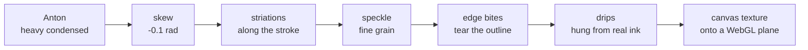

# How This Site Was Built

*A build diary for [michaelthompsondev.netlify.app](https://michaelthompsondev.netlify.app/) — what we made, what went wrong, and why the fixes worked.*

---

## How to read this

This is written to be **learned from**, not skimmed. Each act follows the same shape:

> **The situation** → **what we believed** → **what was actually true** → **what we did about it**

The interesting parts are almost never the code. They are the moments where something *looked*
fine and wasn't. Those are marked:

> 🪤 **Trap** — a failure that produces a plausible-looking wrong answer instead of an error.

Traps are the most valuable thing in this document. A crash tells you where to look. A trap
lets you ship something broken while feeling confident.

---

## Act 0 — The starting point

A folder. No code in it at all.

```
3D website/
├── onezero.fig        11.5 MB   a Figma design file
├── 22.blend           21.8 MB   a Blender 3D scene
├── laptop.mp4         12.0 MB   a rendered animation
└── KulimPark-Light.ttf          a font
```

The design and the 3D scene were made by **[@Bachynskyi_ui](https://www.instagram.com/bachynskyi_ui/)**,
who shared the source files with Michael. The job was to turn a static design into a real,
running website — and eventually into a full personal portfolio.

**The goal:** a fractured sphere, floating in space, reacting as you scroll.

---

## Act 1 — Interrogating the Blender file

Before this session the `.blend` had been *inspected* — but only by reading its raw bytes,
without ever opening Blender. That produced a set of confident, reasonable, **wrong**
conclusions.

Opening it properly changed almost everything.

| What we believed | What was actually true |
|---|---|
| 2,100 shards | **700.** The file holds *three duplicate copies* of the shard collection. The hero uses one. |
| "2,100 draw calls will tank the framerate" | The whole scene is **112,883 triangles** — trivial. Draw calls were the problem; polygon count never was. |
| Use `InstancedMesh` | **Impossible.** 2,100 unique mesh datablocks across 341 distinct topologies. Instancing requires *shared* geometry. |
| The shards are animated → bake a Vertex Animation Texture | **Zero shards have keyframes.** There was no simulation to bake. |
| Geometry Nodes everywhere — must bake them | 2,106 of the 2,108 node modifiers were just **"Smooth by Angle"**, Blender's auto-smooth-normals helper. Not procedural geometry. |
| 4 materials need re-baking to textures | They were **plain Principled BSDFs with zero textures**. They map straight onto glTF. |

### The lesson

Every one of those beliefs was *reasonable*. Each was derived by a careful process. Each was
also false, and every one would have sent the build down an expensive dead end.

> **Measuring costs minutes. Believing costs days.**

---

## Act 2 — Decoding the shatter

The most important discovery: **the effect isn't an explosion.**

The Blender geometry-node graph revealed the real mechanism. A black orb orbits the sphere.
Shards *near the orb* rotate and shrink to nothing — exposing a red wireframe cage underneath.
As the orb moves on, the shell appears to heal behind it.

```
        the orb travels around the shell
                     |
     +---------------|-------------------+
     |        (o)  <- orb                |
     |      /     \                      |
     |     |  hole  |                    |   shards near the orb:
     |     | (cage  |                    |     - tumble
     |      \ shows)/                     |     - shrink to zero
     |        \   /                      |
     +-----------------------------------+
              intact shell
```

**Analogy:** it is not a grenade. It is a **spoon stirring sugar** — the sugar dissolves where
the spoon passes, and the rest sits untouched.

That distinction matters enormously. An explosion is a one-way event you play once. A
dissolving zone is a *loop* — it can run forever, and it can be driven by scroll position
instead of by time.

### Turning a node graph into arithmetic

The graph reduces to four lines. Every constant was read out of the Blender file:

```glsl
float d    = distance(shardCentroid, orbPos) - orbRadius;   // distance to the orb
float f    = 0.2 / d;                                       // closeness, inverted
float ramp = clamp((0.8068 - f) / (0.8068 - 0.3955), 0, 1); // 1 = intact, 0 = gone
float ang  = 14.1 * (1.0 - ramp);                           // tumble as it vanishes
```

Which produces this falloff:

```
 scale
  1.0 |  . . . . . . . . ----------------   shard fully intact
      |                 /
  0.5 |                /
      |               /
  0.0 | -------------/                      shard gone
      +------+-------------+-------------->  distance from orb
           0.25          0.51
           gone         intact
```

### Verifying it before trusting it

Rather than write the shader and hope, the maths was applied in **numpy** to the actual mesh and
rendered, then compared against a render of the untouched Blender scene.

Same hole. Same exposed cage. Same tumbling shards at the boundary. *Then* it was worth writing
as a shader.

> **Prove the maths in the cheapest medium available before committing it to the expensive one.**

---

## Act 3 — Making 700 objects into one

### The actual problem

A **draw call** is one instruction from the CPU to the GPU: *draw this thing*. They are
expensive — not because the GPU is slow, but because each one is a conversation.

**Analogy:** posting 700 letters individually, each with its own trip to the post office,
versus one envelope containing 700 pages. Same paper. Wildly different effort.

700 shards = 700 conversations, every frame, 60 times a second.

### The solution

Merge all 700 shards into **one mesh** — but give every vertex two extra pieces of information
so the shader can still treat them as separate objects:

| Attribute | Meaning |
|---|---|
| `_SHARDC` | the centre of the shard this vertex belongs to |
| `_SHARDR` | a stable random number, unique per shard |

**Analogy:** one bag of LEGO where every brick is stamped with which model it came from. You can
still sort them; you just carry them all at once.

```
  BEFORE                           AFTER
  +---+ +---+ +---+                +--------------------+
  | 1 | | 2 | | 3 |  ... 700       |  one mesh          |
  +---+ +---+ +---+                |  every vertex      |
    |     |     |                  |  tagged with its   |
    v     v     v                  |  shard's centre    |
  700 draw calls                   +--------------------+
                                             |
                                             v
                                       1 draw call
```

The shader reads the tag and moves each shard independently — rotating and shrinking it around
its *own* centre — all inside a single draw call.

**Result:** 4 draw calls for the whole scene (shards, cage, core, orb).

---

## Act 4 — Three bugs that verification caught

None of these were found by reading code. All three were found by checking the *artifact*.

### 🪤 Trap 1 — The coordinate space that silently didn't convert

Blender is **Z-up**. glTF is **Y-up**. The exporter converts `POSITION` and `NORMAL`
automatically… and passes **custom attributes through untouched**.

So the geometry was correct, and every shard's recorded centre was expressed in a different
coordinate system than the geometry it described.

**Analogy:** the map is in metres, the addresses are in feet. Nothing errors. Everything is
subtly, confidently wrong.

Nothing would have crashed. The shatter would simply have looked *odd*, and we would have spent
hours tuning constants that were never the problem.

**Fix:** rotate the centroid at export time so it lands in the same space as the geometry.
**How it was caught:** decode the exported file and check whether each stored centre actually
sits at the middle of its own shard's vertices. 0 of 400 matched. After the Y-up swap, 400 of
400 matched.

### 🪤 Trap 2 — The object that renamed itself

The exporter created an object called `core`. Blender's object namespace is **global**, and a
`core` already existed — so Blender silently renamed the new one `core.002`. glTF then sanitised
that to `core002`.

The JS looked up `nodes.core` and got `undefined`. No error — just a missing piece.

**Fix:** prefix every exported node (`hero_core`, `hero_shards`…) **and make the exporter raise**
if Blender hands back a different name than the one requested.

> Turning a silent rename into a loud crash is a permanent fix. Renaming the object once is a
> temporary one.

### 🪤 Trap 3 — The rotation that didn't survive the move

The shell slowly spins. That rotation was authored in Blender's coordinate system, and **a
rotation cannot be moved to another coordinate system by copying its numbers.** It has to be
*conjugated*:

```
R_three = M · R_blender · Mᵀ        where M converts Blender axes -> Three.js axes
```

Copy the components instead and you get a rotation about a plausible-looking **wrong axis** — it
spins, it looks fine, it is incorrect.

**Fix:** do the conjugation explicitly. **Verified** by checking the resulting matrix was a
0.733 radian rotation about Three's Y axis, which is exactly what the Blender value should
become.

---

## Act 5 — Two decisions that paid off for months

**`src/content.js` holds every visible string.** Rewriting the copy never means touching a
component. When it came time to write the About section much later, it was a one-file edit.

**`src/config.js` holds every tunable number**, each tagged:

- `MEASURED` — taken from the Blender file. Changing it breaks fidelity with the source.
- `TASTE` — free to dial by eye.

**Analogy:** a mixing desk where each fader is labelled *"this one is calibrated"* or *"this one
is yours."* Weeks later, nobody has to remember which was which.

---

## Act 6 — Art direction, round one

The pipeline was provably correct. That is not the same as it looking good.

| Problem | Cause | Fix |
|---|---|---|
| Sphere ate the frame | Camera too close — subject filled 79% of the height and swallowed the type | Pulled back to ~60% |
| **Starfield completely invisible** | Not a bug at all — see below | Retuned radius and size |
| Text landed on top of the giant numerals | Anchored to the card's left edge instead of the design's grid | Positioned by artboard fraction |
| Whole card read as a red gradient, not space | The nebula glow was too broad | Tightened so the corners fall to near-black |

### 🪤 The invisible starfield

The stars were mounted. `visible: true`. In the scene graph. Rendering. **Sub-pixel.**

The camera is a 20° telephoto — a very narrow cone. The star field was distributed over a huge
sphere, so almost every star sat outside the frustum, and the handful inside were smaller than a
single pixel.

**Analogy:** scattering glitter across a football pitch, then looking at it through a drinking
straw. The glitter is definitely there.

This is why *"is it in the scene graph?"* and *"can you see it?"* are different questions, and
why the debugging step that mattered was **querying the live scene** rather than re-reading the
code.

---

## Act 7 — Art direction, round two

Five changes, done one at a time.

### 1. Smoothing — the two-stage damper

The scene read the scroll position **raw**, so every wheel event landed directly on the camera
and the shader uniforms. Smooth scrolling made the *page* smooth; the 3D still moved in steps.

```
BEFORE   wheel --> Lenis --> camera + shader              (stepped)

AFTER    wheel --> Lenis --> damper --> camera + shader   (smooth)
                              ^
                    one place, so every consumer
                    gets it for free
```

The damper is *frame-rate independent* — it feels identical at 60 Hz and 144 Hz — and clamps its
timestep, so a backgrounded tab cannot teleport the scene when you return to it.

### 2. The object was dead until you touched it

Static until scrolled. That reads as a **stalled render**, not as a still image. Slow
sine-driven idle motion fixed it — motion that is smooth by construction, because a sine wave
has no corners.

### 3–5. Removed the inherited numerals, added the painted name, coloured the stars.

---

## Act 8 — Painting a name that doesn't exist as a font

The reference was a heavy Japanese brush face — thick, all-caps, torn edges, ink running off the
letters.

**The catch:** free brush fonts are thin, elegant *handwriting*. Nothing like the reference.

So the brush character is **generated, not borrowed**:



### The part that mattered: bite the *edges*

Scattering erosion randomly across the letters just **pits the middle** — it still reads as a
bold font with a texture over it. What actually breaks the geometric letter shapes is finding
the **real outline pixels** and taking chunks out of *those*.

So the code reads back the rendered alpha, detects edge pixels, and bites there.

```
   random erosion              edge-detected erosion
   +------------+              +------------+
   | ###.#.##   |  pitted      |####### .   |  torn
   | #.###.##   |  interior,   | ######.    |  silhouette,
   | ##.#.###   |  crisp edge  |.#######    |  solid middle
   +------------+              +------------+
     "font + noise"                "brush"
```

The drips are derived the same way — the alpha is scanned to find the **lowest painted pixel in
each column**, so runs hang off real stroke ends instead of being decoration sprinkled nearby.

The whole thing is **seeded**, so the name is identical on every reload. Otherwise it would
subtly reshape itself on each visit, which reads as a glitch.

### 🪤 Two font-loading traps, both silently falling back to a serif

**Trap A:** `document.fonts.load()` resolves with an **empty array — not an error** — when the
`@font-face` rules are not in the CSSOM yet. A single attempt at startup "succeeds" having
loaded nothing.

**Trap B:** the more interesting one. `document.fonts.check(spec)` defaults its sample text to a
**space character**. Google serves fonts as dozens of unicode-range subsets, and the subset
containing the space is *never fetched* for Latin text. So the check reported `false` **forever**,
even though every letter we needed was fully loaded.

**Analogy:** asking a librarian *"do you have this book?"* while holding up a blank page.

**Fix:** ask about the actual glyphs — `check(spec, 'MICHAELTHOMPSON')` — and poll with a
ceiling so a blocked CDN degrades instead of hanging. Plus an off-screen element using the font,
because a font that nothing in the DOM renders can simply sit unfetched.

---

## Act 9 — Shipping it

### The folder that was inside itself

The project lived at `3D website/3D website/`. `npm run dev` failed from the obvious place.
Flattening it surfaced two smaller traps:

- **Windows PowerShell 5.1 has no `&&`.** Every README command in the world breaks. Use `;`.
- **Vite caches absolute paths.** After moving the project it died with `EPERM: rmdir .vite/deps`
  until that cache was deleted.

### What went into the public repo — and what didn't

The design and 3D source belong to @Bachynskyi_ui. He shared them with Michael; that is not the
same as Michael republishing them to the world.

```
committed                        deliberately not committed
---------                        --------------------------
site source                      onezero.fig      (11 MB)
the derived .glb                 22.blend         (21 MB)
the font                         laptop.mp4       (12 MB)
AGENTS.md / README               large reference renders

repo: 2.1 MB                     stays on local disk
```

The derived `.glb` **is** committed, so the site builds from a clean checkout. The raw sources
are not, because the repo does not need them and republishing them was not ours to do.

### Deploy

Config lives in `netlify.toml` rather than a web form, so it is reviewable in a diff. Before
trusting it, the repo was **cloned fresh, `npm ci`, `npm run build`** — because "works on my
machine" and "builds in CI" are different claims, and `public/` is generated.

---

## Act 10 — Making it fast

Two independent problems, both **measured before being touched**.

### Problem 1 — over half the model was a thing you can barely see

Inspecting the per-mesh compressed sizes inside the `.glb`:

```
  hero_cage     624 KB   57%   <-- the wireframe, seen only through the hole
  hero_shards   461 KB   42%   <-- the actual subject
  hero_orb       13 KB    1%
  hero_core       4 KB    0.3%
```

The cage cost **more than the 700 shards combined**.

**Why:** the Wireframe modifier turns *every edge* into an 8-triangle tube. Cost scales as
`(base polys × 4^subdivision) × 8`. Dropping the subdivision one level is a **4× cut**.

**Analogy:** 57% of the shipping weight was packing peanuts.

Rendered at the size it actually appears, the lighter cage **looks better** — the grid reads as
a wireframe instead of a dense white blur.

```
model:  1105 KB --> 643 KB   (-42%)
scene:  112,883 --> 65,267 triangles
```

### Problem 2 — the 3D engine was blocking the text

`App.jsx` imported the 3D scene *statically*. So three.js + drei + postprocessing had to
download **and execute** before React could render a single DOM node.

**Analogy:** the restaurant makes every table wait for the chef to arrive before anyone gets
bread — even the people who only ordered bread.

```
BEFORE   [====== 1.29 MB of 3D engine ======] then text appears

AFTER    [33 KB] text appears
         [====== 3D engine ======] scene fades in behind it
```

Making the scene a lazy import took the entry bundle from **~1.29 MB to 33 KB** (11 KB over the
wire). Vite still emits `modulepreload` hints for the 3D chunks, which is exactly right: they
start downloading immediately but no longer *block* the paint.

Measured: DOM content present at **481 ms**, 3D libraries arriving at 700–745 ms.

### 🪤 The optimisation that wasn't needed

The `.glb` had a `<link rel="preload" as="fetch" crossorigin>`. That pattern is a classic
credentials-mode mismatch that causes the file to be downloaded **twice**.

Rather than "fix" it, it was checked: exactly **one** request, `initiatorType: "link"`. The
loader was reusing the preload correctly.

> Half of optimisation is knowing what to leave alone. That check is now a comment in the repo
> so nobody "fixes" it later.

---

## Act 11 — The rail animation

The Get In Touch panel was an empty glass column. Michael supplied a clip: a character walks in,
puts on headphones, sits down to code.

### The shape problem

```
   the clip                the column
   784 x 1172              ~150 x 466 .. 730
   (about 2:3)             (about 1:3 .. 1:5)

   +--------+              +--+
   |        |              |  |     fitting 2:3 into 1:5
   |  clip  |              |  |     without zooming leaves
   |        |              |  |     242-506 px of EMPTY GLASS
   +--------+              |  |     -- the exact problem the
                           |  |     animation was meant to fix
                           +--+
```

Two bad options and one good one:

| Option | Result |
|---|---|
| `cover` | Fills the column, but crops ~50% of the sides. That is "zooming in", which was ruled out. |
| `contain` | No crop — but the panel stays mostly empty. Solves nothing. |
| **Resize the box** | The container takes the *clip's* aspect ratio. `contain` then fills it exactly. |

Once Michael offered to resize the panel, the third option became available: the media block was
given the video's **exact** ratio (784/1172), so `object-fit: contain` fills it edge to edge —
**no zoom, no crop, no letterbox** — with the social icons overlaid on top.

> When the content is fixed and the container is negotiable, **move the container**.

### The 5.4 MB problem

The source clip was larger than the entire rest of the site combined — after a whole session
spent cutting load time.

There is no ffmpeg on this machine, and **Blender 5.2 ships with no video output at all** (its
format list is images only). So the transcode ran **in the browser**: draw each frame to a
canvas, record with `MediaRecorder` as H.264, drop the audio track.

```
5,550 KB  -->  148 KB      (-97%)
```

Visually indistinguishable at display size — verified by comparing frames side by side, not by
assuming.

### 🪤 The recorder that stretched time

First attempt: seek to each frame, draw it, push it. Result — a 6.04 s clip became **8.67 s**.

**Why:** `MediaRecorder` timestamps frames by **wall clock**, not by the timestamps you intend.
Seeking each frame took longer than the frame interval, so the recording stretched.

**Analogy:** recording a music box by holding a microphone to it while winding the handle by
hand. The recording plays back at whatever speed you turned the crank.

**Fix:** let the video **play at 1×** and sample the canvas as it goes. Playback is its own
real-time clock, and — usefully — media playback keeps running in a hidden tab where
`requestAnimationFrame` does not. Result: 6.04 s → 6.07 s.

### Three states, not two

```
   >= 901px, motion ok   ->  the video loop
   >= 901px, reduced     ->  a poster still   (an empty box is what this feature exists to fix)
   <  901px              ->  nothing at all   (the rail is display:none)
```

That third case matters: a hidden `<video autoplay>` **still downloads**. Resolving the state
*before* first render means a phone never fetches it. Verified on a fresh mobile load: **zero
rail assets fetched.**

The video also **pauses when you scroll away**, instead of decoding for as long as someone reads
the page.

---

## The patterns underneath all of it

Strip out the specifics and the same handful of ideas keep reappearing.

### 1. Verify the artifact, not the source

Reading code tells you what you *meant*. Checking the output tells you what you *made*. Every
serious bug here was caught by inspecting the exported file, querying the live scene, or
rendering the result — never by re-reading the code.

### 2. Silent fallbacks are worse than crashes

A crash has a stack trace. A silent fallback has a plausible result:

- Custom attributes quietly not converted → a shatter that just looks "a bit off"
- An object quietly renamed → a missing piece with no error
- A font check quietly false → a serif that is *nearly* right

Every one of those was fixed **and** turned into something loud: an assertion, a prefix, a
console warning.

### 3. Fix it upstream where it is cheapest

The cage was fixed in the *exporter*, not the renderer. Half a megabyte disappeared from every
visitor's download because of one changed number in a Python script.

### 4. Measure before optimising, and measure again after

"The model is too big" was true, but *why* it was big was surprising. "The site is slow" was
true, but the cause was JavaScript blocking paint, not the model at all. Guessing would have
fixed neither.

### 5. Move the container, not the content

The rail animation only worked once the panel was allowed to change shape. When you are fighting
to fit something, check whether the thing you are fitting it *into* is actually fixed.

---

## Where it stands

| | |
|---|---|
| **Live** | [michaelthompsondev.netlify.app](https://michaelthompsondev.netlify.app/) |
| **Repo** | [thompmic/shattered-sphere-webgl](https://github.com/thompmic/shattered-sphere-webgl) |
| **Model** | 643 KB, 65,267 triangles, 4 draw calls |
| **Entry JS** | 11 KB over the wire |
| **Rail clip** | 148 KB |

### Still open

- **Two of three project repos are private**, so those cards carry no link rather than a broken
  one. Making them public is the highest-value change left.
- **No loading state** for the model — the hero still pops in.
- The rail clip carries a **KlingAI watermark**, dimmed but visible.
- Scroll smoothness has a dial (`SCROLL.damping`) that wants a pass with a real hand on a real
  wheel.

---

*Credit where it is due: the concept, the visual design and the Blender scene are
[@Bachynskyi_ui](https://www.instagram.com/bachynskyi_ui/)'s, shared directly with Michael. What
is documented above is the engineering that turned them into a website.*
